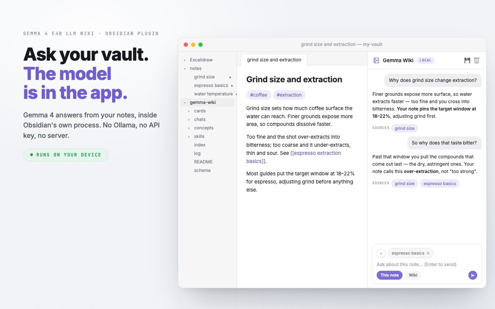
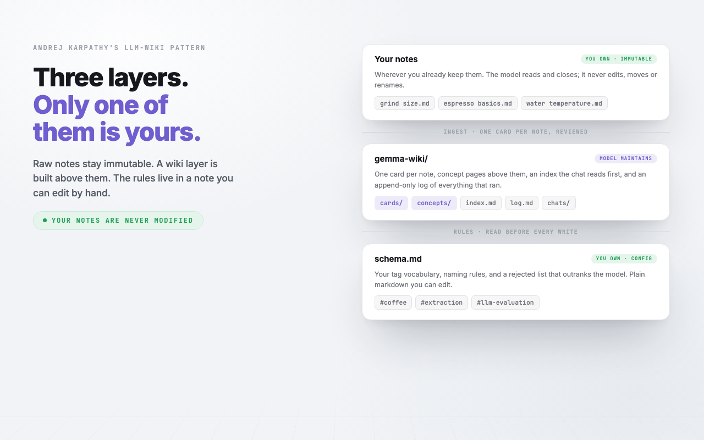
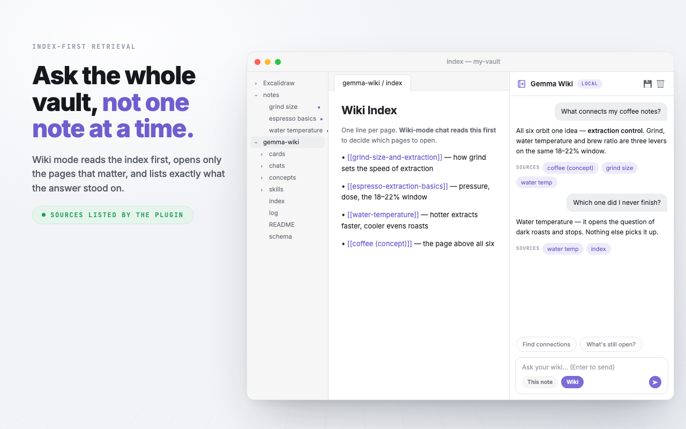

  <picture>
    <source media="(prefers-color-scheme: dark)" srcset="assets/logo-dark.svg">
    
  </picture>

<h1 align="center">Gemma Wiki</h1>

<em>A Karpathy-pattern LLM wiki for Obsidian, powered by Gemma 4 running entirely inside Obsidian via LiteRT-LM + WebGPU.</em>

<b>English</b> · <a href="README.ja.md">日本語</a>

<a href="https://gemma-wiki-demo.vercel.app/tour.html"><b>▶ See what it does</b></a> · <a href="https://gemma-wiki-demo.vercel.app"><b>Step through the demo</b></a> — nothing to install.

**Free, private, offline AI for your notes** — no API key, no subscription, no tokens ever billed, no account to make.

Gemma 4 E4B runs inside Obsidian's own process via [LiteRT-LM](https://github.com/google-ai-edge/LiteRT-LM) and WebGPU. Not Ollama, not LM Studio, not a localhost server — the model is *in* the app. **Your notes are never uploaded anywhere, because there is no server to upload them to**: privacy here is a property of the architecture, not a promise in a policy. After its one-time downloads — the ~3 GB model and the WebAssembly runtime, both listed under [Privacy](#-privacy) — the plugin never touches the network again.

It implements **[Andrej Karpathy's LLM-wiki pattern](https://gist.github.com/karpathy/442a6bf555914893e9891c11519de94f)**: your raw notes are never modified *by the model* — the immutability constraint binds the LLM, not you, and editing your own notes is the normal fix when a chat surfaces a mistake (the wiki detects the change and offers to re-ingest). A separate, cross-linked wiki layer is built above them — one card per note, and **every page is shown to you in full before a single byte is written**.

From there: chat grounded in one note or in the whole wiki, quiz yourself on either, build concept pages across everything sharing a tag, and let it flag its own decay with lint, provenance and contradiction checks. **Sources are listed by the plugin, never cited by the model** — citation is the one thing a small local model would get wrong without anyone noticing.

Everything it writes is plain markdown in your vault — nothing is locked in a database, and nothing needs another plugin to read it back. Its own configuration is notes too: **your tag vocabulary and naming rules live in `schema.md`**, where you can edit them by hand and the plugin will obey; **every operation is appended to `log.md`**, so you can always see what it did and when; and **dropping a markdown file into `skills/` adds a command of your own** to the ⚡ menu.

> **Status: 1.0.0.** The core loop of [Andrej Karpathy's LLM Wiki pattern](https://gist.github.com/karpathy/442a6bf555914893e9891c11519de94f) is implemented and running: review-gated ingest into a `gemma-wiki/` layer with cross-links, an `gemma-wiki/index.md` catalog and append-only `gemma-wiki/log.md`, index-first grounded chat with deterministic source attribution, answers saved beside the material that produced them (kept to re-read, never retrieved), a model-free check-then-repair pass, and canned single-task skills. Submitted to the community plugin store; until it appears there, install from a [release](../../releases). Benchmarks below are from real use.

## 📑 Contents

- [✨ Features at a glance](#-features-at-a-glance)
- [💬 Chat with your notes — entirely offline](#-chat-with-your-notes--entirely-offline)
- [🤔 Why this exists](#-why-this-exists)
- [🔌 How this differs from Ollama / LM Studio plugins](#-how-this-differs-from-ollama--lm-studio-plugins)
- [📋 Requirements](#-requirements)
- [🔁 What to run when](#-what-to-run-when)
- [⌨️ Current commands](#️-current-commands)
- [🔧 How it works](#-how-it-works)
- [📊 Benchmarks](#-benchmarks)
- [🗺️ Roadmap](#️-roadmap)
- [🔒 Privacy](#-privacy)
- [💖 Credits](#-credits)

## ✨ Features at a glance

Sixteen commands, and this is what they add up to. Every row is covered in
detail below; the full command list is under
[Current commands](#️-current-commands).

| | What it does | Touches your notes? |
| --- | --- | --- |
| **Ingest / Scan** | One card per note in a separate `gemma-wiki/` layer, previewed in full before anything is written | No |
| **Chat** | Grounded in one note or the whole wiki, with sources listed by the plugin rather than cited by the model | No |
| **⚡ Skills** | Quiz, flashcards and find-gaps on the open note, plus any prompt file you drop in `skills/` | No |
| **Concept pages** | A page built *above* every card sharing a tag, linking down into each | No |
| **Keep it honest** | Review board, provenance spot-check, contradiction sweep, and a model-free tidy pass | No |
| **Improve** | Rewrites structure and typos, preserving your wording and voice | **Yes**, always previewed |
| **Suggest tags & links** | Proposes frontmatter tags and wiki links for the open note | **Yes**, always previewed |

Two of the sixteen write into a note you wrote, both behind a preview. The
rest build and maintain a layer beside your notes and never touch them.

**The Karpathy loop** — raw notes stay read-only; the plugin maintains a separate `gemma-wiki/` layer:

- **Ingest** — one strict JSON extraction per note (summary, tags, key points, salient mentions, and a self-rated `high`/`med`/`low` confidence written to frontmatter), plus a validated multiple-choice pick of related pages from the index catalog. Everything previews in a review modal; nothing is written without approval. Ingested notes get a badge in the file explorer — pure UI decoration, the note file is untouched.
- **Scan (semi-automatic ingest)** — sweep the folders you named for new or changed notes, draft a card for each, and review them all in one list **sorted low-confidence first**, so the pages most in need of a human eye are the ones you read first. Untick anything that should not have become a page. Opt-in by scope: leave the folder list blank and scan refuses to run rather than sweeping your vault.
- **index.md / log.md** — a one-line-per-page catalog the query path reads first, and an append-only, grep-friendly activity log.
- **Query (Wiki mode)** — index-first retrieval with stopword filtering; the catalog and recent log always ride along, so meta-questions ("what did I add today?") work; answers are grounded only in retrieved material with honest refusals otherwise.
- **Whole-wiki questions ground in every page**, not in the ones that lexically match. *"What connects my pages"* is about the shape of the collection, so scoring it against page summaries matches nothing — the words in the question appear in no summary — and the model is handed zero pages and correctly reports it was given none. The two chips that ask this kind of question carry the flag; `loadPages` fills to the budget and stops.
- **Save an answer as a note** — every reply has a save action (same review gate), and it writes the answer **into your own notes**, beside the note it came from, named `gemma — Summarize — The perfect espresso shot` so the file explorer shows at a glance both that a model wrote it and what it was about, and recording in frontmatter which model and from which sources — the two things a copy-paste destroys silently. It lands in your folders, under your organisation, and it survives deleting the wiki folder, which nothing the plugin owns is meant to. Being an ordinary note of yours, it is also the one thing a saved answer never used to be: **ingestable**. Scan it and it becomes a card like any other note — which is the only route by which anything becomes material, because everything the wiki retrieves derives from a note you wrote.
- **Everything retrievable derives from a note you wrote.** That holds structurally rather than by convention: only `cards/` (one card per ingested note) and `concepts/` (built across those cards) are in the retrieval set.
- **Saved answers are never retrieved.** Karpathy's gist says explorations should compound and says nothing about trust, which is the poisoning loop — a wrong or stale answer re-entering context with the same weight as the notes. So a saved answer is not in the retrieval set at all: it is an ordinary note of yours, kept to re-read, with frontmatter recording which model wrote it and from which sources. The one route back in is deliberate and human — judge it, and ingest it like anything else you wrote.
- **Concept pages** — pick a tag or mention two or more pages share, and the plugin writes a page *above* them that links down into each one. Ingest ripples into them, and member lists self-heal in both directions.

**Keeping it honest** — a wiki nobody reviews is the failure mode this is built against:

- **Review board** — three ways a page goes bad, in one queue: low self-rated confidence, **source drift** (the raw note changed since ingest, caught by `source_hash`), and staleness. Concept overviews are checked too.
- **Provenance spot-check** — takes a page's key points back to the raw note to find the sentence each came from, and flags the ones that cannot be traced.
- **Contradiction sweep** — checks pairs of pages that share a tag for claims that disagree, recently-changed pairs first. It flags with the model's reason quoted and **never edits** — you decide which one was wrong.
- **Tidy the wiki** — one command that checks first and then fixes only what you tick. The check is model-free: orphan pages, index entries pointing at deleted pages, pages missing from the index, and how far your pages' tags have drifted from the vocabulary. The four repairs — make links mutual, drop dead index entries, rebuild the vocabulary, apply it to existing pages — are always offered, ticked where the check found something; each runs in turn behind its own preview. Availability is never tied to detection, because a check good enough to pick a sensible default is not good enough to be the only way in.
- **Background count** (off by default) — periodically *counts* new or changed notes into a status-bar chip. Counting never runs the model; drafting only happens when you click.

**Config as notes** — the rules live as plain markdown you can read, edit and version:

- **`schema.md`** — your tag vocabulary, naming rules, and a **rejected list**: a tag you deleted by hand does not come back. *Organize tags* has local Gemma merge near-synonyms into one vocabulary; *Retag* applies it to existing pages, both behind a preview.
- **`skills/`** — one file per entry in the ⚡ menu. Frontmatter for name/icon/mode, the body is the prompt; a `> [!info]` callout in the body is documentation and is stripped before the model sees it. `fill: true` puts the prompt in the input box and waits rather than sending, for a skill that has to be aimed at something. Ships with a README and two examples, which carry a `stamp:` hash so a later release can improve them **unless you have edited the file**, in which case it is yours forever.
- **`chats/`** — a conversation you pressed save on, one file per thread, with its own `index.md` listing them newest first. **Nothing in it is retrieved, indexed, linted or scanned** — an answer is output, never input, and a chat sitting in the wiki index would be indistinguishable from a page. It is also the only thing under the wiki folder the plugin cannot rebuild from your notes, so move it out before clearing that folder.
- **Every folder has a README** explaining what belongs in it, and the layout is shown in Settings with per-row state, generated from the same list the scaffold builds from.

**Chat panel** — shadcn-inspired monochrome, theme-variable driven:

- **Two grounding modes**: *This note* (the open file) and *Wiki* (your ingested pages).
- **Deterministic Sources row** on every answer — the plugin lists exactly what was used, clickable; citation is never left to the model.
- **`+` attachments** — fuzzy-pick any notes as removable context pills, in either mode.
- **⚡ Skills** — canned single-task prompts: *Quiz*, *Flashcards*, *Find gaps*, plus *Action items* and *Unclear bits* as editable files, plus anything else in `skills/`. A skill file is frontmatter and a prompt, so the menu holds *questions*; anything that **does** something (scan, file a note, reformat one) is a chip above the input instead.
- **Skills declare the mode they need, and are greyed when it is the wrong one** rather than switching you into it — a menu item should not quietly change what the panel is grounded in. All the shipped ones are note-scoped, because in Wiki mode they retrieved nothing: the lexical scorer matches prompt words against page summaries, and *"create practice questions from this material"* shares no vocabulary with a page about compound interest.
- **✨ Improve formatting** — the one write action on raw notes, and the most constrained call in the plugin: structure/formatting/typos only, wording and voice preserved, full-result preview before anything is written. Long notes are split on headings and blank lines into passes that each fit the context window, rewritten one pass at a time and stitched back together; a selection still narrows it to one section.
- **Three fixed chips above the input**, the one part of the panel that never disappears. In Wiki mode: *Scan a folder*, *Find connections*, *What's still open?* — and the first becomes **Stop scan** while a scan is running, including one started from the command palette. They do not rearrange themselves when the wiki is empty: asking a wiki question with nothing filed answers "there is nothing here" and **that answer carries the buttons to fix it**, so the remedy travels with the problem instead of hiding the other chips from the person still working out what this does.
- Streaming replies with a typing spinner, stop button, copy/regenerate actions, auto-growing + expandable input, clear-chat, hover tooltips everywhere.

**Engineering rules the whole plugin follows**:

- Every model operation is **one structured ask** — no tool loops, no multi-step planning; small local models are unreliable at chaining and reliable at filling one schema.
- **One operation at a time.** There is one engine, one status line and one clock, so starting a second is refused with a message naming what is already running — and every door it could come through closes while one runs: the chips grey, the skills menu greys with a line saying what is busy, and the chat input refuses. A streaming answer counts as an operation, which it did not at first, so pressing *Formatting* mid-answer used to start a second call on the same GPU.
- Every write goes through a **preview-approve gate**. Raw notes are modified by exactly two features (Improve, and Suggest tags & links), both always previewed.
- Grounding means **the material is the subject**, not the only vocabulary the model may use. Both modes hold the same line: a question about *your material* is answered only from it, and refused honestly when it does not answer; a question about *what something means* is explained, keeping what your material states separate from what the term means. What differs between the modes is scope, not the rule — and in Wiki mode the separation has to be visible in the text, because the Sources row stands for pages you are not looking at.
- The prompt separates four cases, because collapsing them is how a small model produces confidently wrong refusals: a **question of fact** the material does not answer (say so), an **instruction** to work with it (carry it out — asked for flashcards it used to go looking for flashcards *inside* the note and refuse), a **request to explain** something the note uses (explain it; echoing the note's own sentence back is not an answer), and a **request it cannot parse** (say it did not follow, and ask again). The last matters most: a fragment used to come back as *"I do not have information regarding X in the provided notes"*, which implies the notes might have had it when the truth is the model did not understand the question.
- Per-feature input budgets are derived from the context window **the engine actually granted**, read back from `Engine.create` rather than assumed from the setting — LiteRT-LM may clamp `maxNumTokens`, and every budget derived from the request would then overshoot.
- **One notification vocabulary** (`src/notify.ts`): six kinds each with a single meaning, three durations instead of ten hand-picked numbers, and no call site choosing a millisecond count. `noop` deliberately carries no mark — a command that correctly did nothing is not an event. Failures never print a raw exception; they name the operation, give the first line of the reason, and say where the rest is. Warnings and errors are also appended to `log.md`, because a toast is not a record.
- **Three surfaces, one job each.** A toast is a *moment*, so it reports starts and results. A run is not a moment: progress lives in the status bar, which is always visible, never covers the note, cannot be dismissed by accident, and can be clicked to repeat itself. And a result dialog **only opens by itself if you never looked away** — if you went back to your notes while a multi-minute scan ran, it waits on the status bar until you ask for it, rather than stealing the window out from under whatever you were typing.

## 💬 Chat with your notes — entirely offline

Click the book-and-spark ribbon icon to open the side panel. Two grounding modes, switched with a pill toggle:

- **This note** — answers strictly from the currently open note.
- **Wiki** — the Karpathy Query path: reads the `gemma-wiki/index.md` catalog first, loads the top-matching ingested pages, and answers only from them (plus the catalog and recent activity log, so meta-questions like "what did I add today?" work too).

Either way: answers stream in from a model running inside Obsidian's own process, every answer ends with a deterministic **Sources** row (clickable — listed by the plugin, not left to the model to cite), per-message **copy / regenerate / save-as-note** actions, and a **save-conversation** button in the panel header that keeps the whole thread — the questions included, which are the half you cannot reconstruct from the answers. Both modes refuse honestly when the material doesn't answer a question about your notes, and both will explain a term your material uses instead of repeating it back at you — keeping what the material says separate from what the term means. A **+** button attaches additional notes as removable context pills; a **⚡ skills** menu runs canned single-task prompts (*Quiz*, *Flashcards*, *Find gaps*) against the open note.

## 🤔 Why this exists

Most "local AI" Obsidian plugins still depend on a second, independently-running application — Ollama or LM Studio has to be installed and running in the background before the plugin does anything. That's local in the sense that your notes don't leave your machine, but it isn't local in the sense of "install the plugin and it just works."

This project asks a narrower question: **can the model run in the exact same process as the plugin, using only what Electron and WebGPU already provide?** The answer, validated end to end (see [Benchmarks](#-benchmarks)), is yes — for short, well-scoped text tasks. Whether it's enough to carry a full Karpathy-style wiki (entity/concept extraction, cross-referencing, contradiction detection) is the open question this project is working through, one validated step at a time, in public commit history.

## 🔌 How this differs from Ollama / LM Studio plugins

|  | This project | Ollama/LM Studio-backed plugins |
|---|---|---|
| **External process** | None. The model runs inside Obsidian's own renderer. | Requires Ollama/LM Studio installed and running separately. |
| **Setup** | Install the plugin; first run downloads the model once. | Install the plugin *and* a separate app; configure a connection between them. |
| **API surface** | Nothing to configure and no inference API. There *is* one moving part worth naming: the WebGPU runtime can only be handed multi-gigabyte weights over HTTP, so the plugin runs a loopback server on an ephemeral port to feed itself the model and runtime bytes off your own disk. It binds `127.0.0.1`, carries no inference endpoint, and lives only while the plugin is loaded. | Talks to `localhost:11434` (or similar) over HTTP — a separate app you start, configure and keep running. |
| **Trade-off** | Ties the plugin to whatever LiteRT-LM supports today. | More provider flexibility, but a heavier setup and a permanently-running background app. |

This isn't a claim that local-in-renderer is strictly *better* — it's a different point in the design space, and "fully local" only matters if the output quality holds up. That's exactly what the benchmarks below are trying to establish honestly, including where the approach is weaker.

## 📋 Requirements

- Obsidian 1.11.4+, **desktop only** (macOS / Windows / Linux — no mobile; this plugin is not published in `isDesktopOnly: false` form)
- A WebGPU-capable GPU and browser runtime (Obsidian's bundled Electron/Chromium)
- ~3 GB free disk space for the [`litert-community/gemma-4-E4B-it-litert-lm`](https://huggingface.co/litert-community/gemma-4-E4B-it-litert-lm) model, downloaded once and cached on disk
- A further ~20-31 MB for the LiteRT-LM WebAssembly runtime, fetched on first use. The runtime ships in four variants and your machine only ever loads one of them, chosen by the library from its own feature probes — so only that one is downloaded
- Network access for those one-time downloads only — no network calls after that

> **If you sync this vault, exclude the model file.** It is downloaded to
> `<vault>/.obsidian/plugins/gemma-litert-wiki/gemma-4-E4B-it-web.litertlm` — Obsidian gives a
> plugin nowhere outside the vault to write — so iCloud, Dropbox, and Obsidian Sync with
> "community plugins" enabled will all replicate ~3 GB to every machine. Each machine can download
> it once for itself in a fraction of that time. The wiki folder itself is ordinary markdown and
> should sync normally.
>
> Note that `data.json` (which holds your knowledge-folder name) often does *not* sync. If you
> rename the folder on one machine, the other will not know — it now notices a folder that looks
> like a wiki and asks before creating a second one, but the cleanest fix is to rename it the same
> way on both.

## 🔁 What to run when

Sixteen commands, four habits. Everything else is occasional.

| When | Run | Why |
|---|---|---|
| You wrote or clipped some notes | **Scan a folder into the wiki** | Drafts a card per new or changed note, review-gated, lowest confidence first. |
| Right after a scan | **Tidy the wiki** | Ingest coins tags page by page, so a batch fragments the vocabulary and links only point one way. Tidy folds near-duplicate tags into one list and makes links mutual — the completion notice says so when the batch made it necessary. |
| A theme keeps showing up | **Build a concept page** | Once two or more pages share a tag or mention, this writes the page above them. |
| Every few weeks | **Review board**, then **Provenance spot-check**, then **Find contradictions** | The three ways a wiki quietly goes bad: pages whose notes changed, key points the note never said, and pages that disagree. All three flag; none edits. |

Chat needs no schedule — it reads whatever the wiki holds. And the two
commands that write into your own notes, **Improve** and **Suggest tags &
links**, are run on one note when you want them, never as routine.

## ⌨️ Current commands

All of these are on the command palette (<kbd>Cmd/Ctrl</kbd> + <kbd>P</kbd>) under *Gemma Wiki*.

**Ask**

| Command | What it does |
|---|---|
| **Chat with active note (local Gemma)** | Opens the chat panel — This-note / Wiki modes, `+` attachments, ⚡ skills, save-as-note. See [above](#-chat-with-your-notes--entirely-offline). |

**File notes into the wiki**

| Command | What it does |
|---|---|
| **Ingest this note into wiki (local Gemma)** | One strict JSON extraction (summary, 3 tags, 3–5 key points, salient mentions, self-rated confidence) plus a validated related-pages pick from the index — previewed in a review modal, written only on approval. Raw notes are never modified by the plugin; ingested notes get a badge in the file explorer. |
| **Scan a folder into the wiki (batch, local Gemma)** | The same extraction across whole folders, for new or changed notes only. Opens a dialog that **counts what each folder holds and estimates the run time before you commit**, remembers your last pick, drafts everything first, then shows one review list **sorted low-confidence first**. Scope is opt-in: it never sweeps the vault without you ticking a folder. |
| **Stop the running scan** | Only in the palette while a scan is running; the *Scan a folder* chip becomes *Stop scan* at the same time. A model call cannot be interrupted, so **the note in flight finishes and is kept** — everything drafted so far still goes to the review list, and the rest is offered on the next scan. Stopping never loses work and never writes anything. |
| **Suggest tags & links for active note (local Gemma)** | Proposes frontmatter tags and links to related wiki pages for one note, behind a preview. |

**Build the layer above**

| Command | What it does |
|---|---|
| **Build a concept page from a tag or mention (local Gemma)** | Pick a tag or mention two or more pages share; writes a page *above* them that links down into each. Member lists self-heal in both directions. |

**Keep it honest**

| Command | What it does |
|---|---|
| **Review board (low-confidence, drifted, and stale pages)** | One queue for the three ways a page goes bad: low self-rated confidence, source drift caught by `source_hash`, and staleness. |
| **Find contradictions in wiki (local Gemma)** | Checks pages sharing a tag for claims that disagree, recently-changed pairs first. Flags with the reason quoted and **never edits**. |
| **Provenance spot-check (local Gemma)** | Traces each key point on a page back to a sentence in the raw note, and flags what cannot be traced. |
| **Tidy the wiki (check, then fix what you approve)** | The five maintenance commands in one. A model-free check reports orphans, dead index entries, unindexed pages and tag drift; then four repairs — make links mutual, drop dead index entries, rebuild the tag vocabulary, apply it to existing pages — are offered together, ticked where the check found something, and run in turn behind their own previews. |

**Write into your own note — the only one that does**

| Command | What it does |
|---|---|
| **Improve formatting of active note (local Gemma)** | Structure, lists and typos only; wording and voice preserved. Long notes are split on headings and blank lines into passes that each fit the context window, rewritten one pass at a time and stitched back byte-exactly; you are told the pass count before it starts. A selection narrows it to one section. Full-result preview before anything is written. |

**Setup and diagnostics**

| Command | What it does |
|---|---|
| **Download model (one-time, ~3GB)** | Downloads and caches the model with live progress, instead of waiting for the first command to trigger it. |
| **[Test] Check WebGPU** | Confirms a usable WebGPU adapter is available. *(The four `[Test]` commands are hidden unless Settings → Model → Developer commands is on.)* |
| **[Test] Load WASM runtime (no model download)** | Loads the LiteRT-LM WASM runtime without the model — isolates runtime issues from model issues. |
| **[Test] Fix grammar of selection** | Runs a real generation on the selection, logging prefill/decode speed and time-to-first-token to the console. |
| **[Test] JSON reliability test (5 runs)** | Five independent structured-JSON generations against the selection, reported as a pass rate — the risk test for whether the model can reliably drive the ingest pipeline. |

## 🔧 How it works

Getting a local model to run inside Obsidian's renderer — instead of a Chrome extension's offscreen document, which is where every existing LiteRT-LM web example runs — surfaced two Electron-specific problems that don't show up in a normal browser tab:

1. **`file://` script tags are blocked.** LiteRT-LM's WASM loader injects a `<script src="...">` tag to load its Emscripten glue code. Obsidian's own page isn't served from a `file://` origin, and Electron's local-resource guard refuses to load a `file://` script from a non-`file://` page. **Fix:** serve the `wasm/` directory over a `127.0.0.1` loopback HTTP server started from the plugin itself, with permissive CORS headers.

2. **The WASM glue misdetects its own script directory.** `litertlm_wasm_internal.js` checks `typeof __filename` to decide whether it's running under Node.js. Obsidian's desktop app is a Node-integrated Electron renderer, so `__filename` *is* defined — but it points at Obsidian's own internal file, not the dynamically-injected WASM script. This hijacks the correct `document.currentScript`-based path resolution, and the model binary fetch silently falls back to resolving against Obsidian's own page origin instead of the plugin's server. **Fix:** pre-seed `self.Module.locateFile` before calling `loadLiteRtLm()` — the loader checks for this override before running its own (broken, in this environment) auto-detection.

Once loaded, the plugin keeps a single `Engine` instance alive for the lifetime of the Obsidian session (see `ensureEngine()` in `src/main.ts`) so the ~3 GB model and GPU warmup cost are paid once, not per command.

## 📊 Benchmarks

All numbers are from `Conversation.getBenchmarkInfo()` — real LiteRT-LM instrumentation, not estimates — measured on real hardware, not vendor-quoted figures.

| Scenario | Prefill | Decode | Time to first token |
|---|---|---|---|
| Cold engine, 2098-token input | 74.7 tok/s | 29.1 tok/s | **28.1 s** |
| Warm engine, 1558-token input | 495.0 tok/s | 28.9 tok/s | 3.2 s |
| Warm engine, 274-token input | 386.5 tok/s | 29.5 tok/s | **0.74 s** |
| Warm engine, 634-token input (full paragraph) | 494.7 tok/s | 29.1 tok/s | 1.3 s |

**Takeaway:** the ~28 s cold-start figure that shows up on the very first call is a one-time GPU shader-compilation / weight-conversion cost, not a per-call tax — once the engine is warm, prefill throughput jumps roughly 5-6×, and short-selection latency drops to sub-second. Decode speed (~29 tok/s) is stable regardless of input length or warm/cold state.

**Quality**, checked by hand against six English test passages (basic typos, subtle grammar, a passage with zero errors, a bulleted list, technical jargon that should *not* be "corrected", and a 700-word article with errors scattered through the final paragraph): zero missed errors, zero hallucinated changes, exact-match output on the already-correct passage, all technical terms and list formatting preserved, and no quality drop-off between the first and last paragraph of the long passage.

**Structured output reliability**: 5/5 independent runs produced valid, correctly-shaped JSON (`{"summary": string, "tags": string[3]}`) with greedy sampling — the load-bearing assumption behind an eventual ingest pipeline.

## 🗺️ Roadmap

Implemented — the Karpathy core loop, scoped deliberately to what a small on-device model has been validated to carry:

- **Ingest** with a review gate (nothing written without approval), single-schema extraction, related-page cross-links picked from the index catalog, and a confidence rating in page frontmatter.
- **Query** via index-first retrieval with stopword filtering, catalog + activity log always in context, deterministic source attribution, and save-answer-into-your-own-notes — kept to re-read, deliberately not fed back as grounding.
- **Tidy**, model-free where it can be: orphans and index health are checked without the model; the four repairs run only on what you tick.

Everything once listed as next has since landed: user-defined skills (drop a file in `skills/`), model-assisted contradiction candidates (flagged for human judgment, never auto-fixed), a content-hash dedup gate in scan, and the review board. What actually remains is the community-store submission itself — under review.

Deliberately out of scope: a multi-provider abstraction layer, image input (the LiteRT-LM web runtime does not support it yet), PDF OCR, and any retrieval scheme more complex than "read the index, then read the pages it points to" — field reports put the flat-index breaking point around ~77 pages, far above this wiki's current size; that decision gets revisited there, not before.

## 🔒 Privacy

No backend, no telemetry, no analytics. This plugin makes network requests to exactly two hosts, both one-time downloads of things it needs to run, both cached on disk afterwards:

| Host | What | When |
| --- | --- | --- |
| `huggingface.co` | the [Gemma 4 E4B model](https://huggingface.co/litert-community/gemma-4-E4B-it-litert-lm) (~3 GB) | once, when you press **Download model** |
| `cdn.jsdelivr.net` | the LiteRT-LM WebAssembly runtime (~20-31 MB), from the pinned `@litert-lm/core` version this build was compiled against | once, on first use |

The runtime is fetched rather than bundled because it ships in four variants totalling ~101 MB and your machine loads exactly one, chosen by the library's own feature probes; shipping all four would put a 101 MB payload in every install to use a fifth of it. Only files matching `litertlm_wasm_*internal.{js,wasm}` are accepted, and nothing here updates the plugin itself — the version is fixed at build time.

The plugin also runs a **loopback HTTP server** (`127.0.0.1`, ephemeral port, alive only while the plugin is loaded). It exists because the WebGPU runtime can only be handed the model over HTTP; it serves files from your own disk to your own machine, has no inference endpoint, and is not reachable from outside it.

**Nothing else leaves your machine.** Your notes, your questions and every generated answer stay on-device: inference, caching and generation all happen inside Obsidian's own process. There is no server to upload them to.

## 💖 Credits

- [Andrej Karpathy — LLM Wiki](https://gist.github.com/karpathy/442a6bf555914893e9891c11519de94f) for the three-layer (raw / wiki / schema) pattern this project is working toward.
- [litert-community](https://huggingface.co/litert-community) for the web-packaged Gemma 4 E4B checkpoint this plugin loads.
