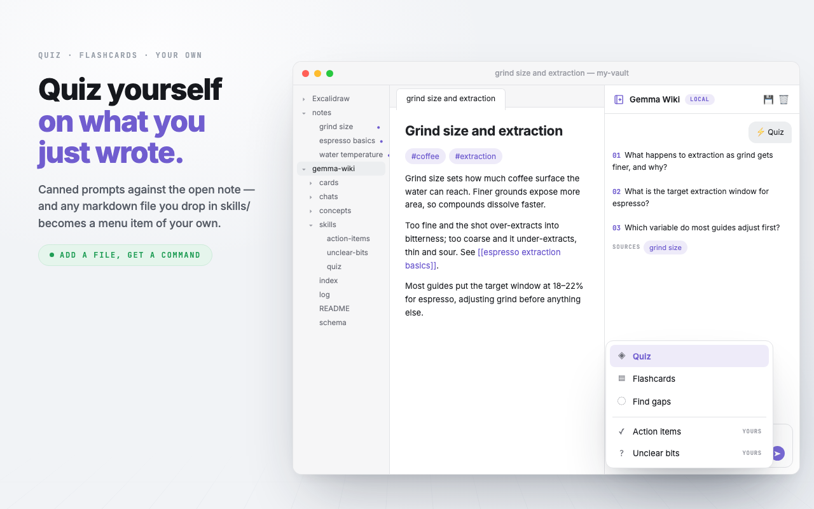
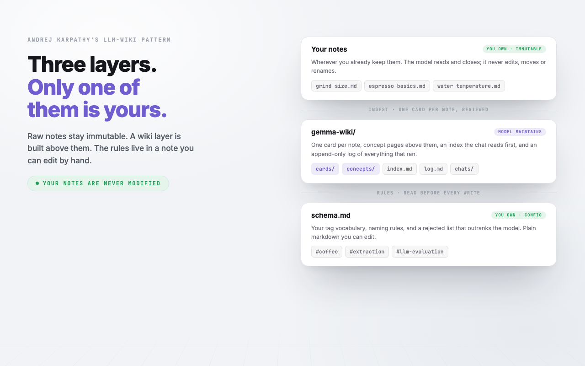
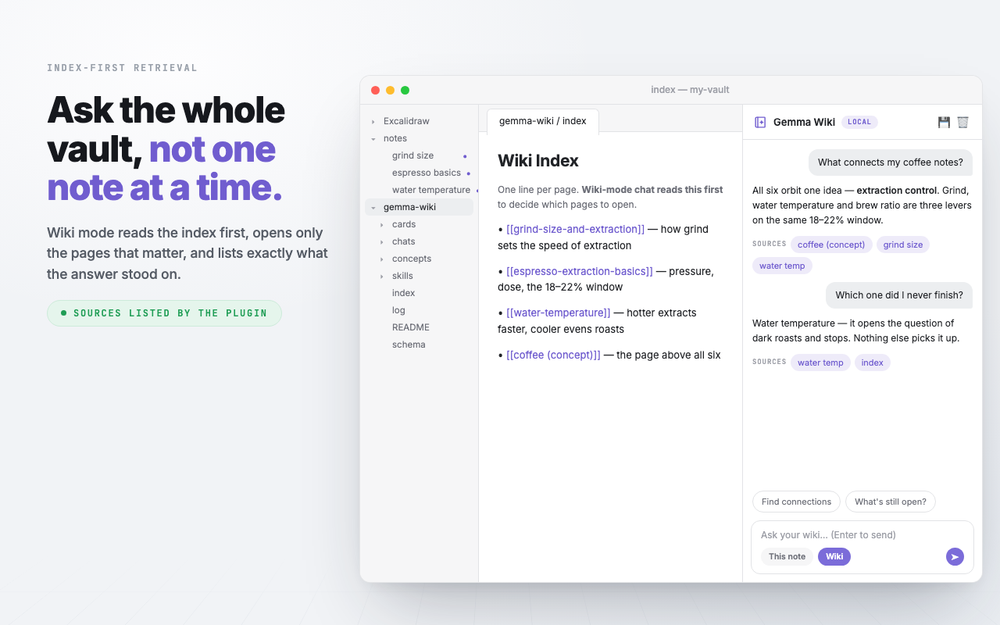
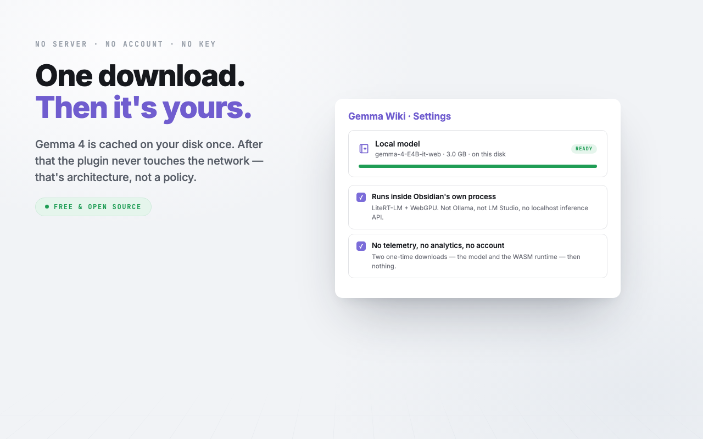

  <picture>
    <source media="(prefers-color-scheme: dark)" srcset="https://raw.githubusercontent.com/itsyuimorii/obsidian-gemma4-litert-wiki/main/assets/logo-dark.svg">
    
  </picture>

<h1 align="center">Gemma 4 E4B LLM Wiki</h1>

<b>Turn your notes into a living Karpathy LLM wiki.</b> Chat with your vault, connect ideas, find gaps, and generate quizzes &amp; flashcards — with <b>Gemma 4 E4B</b> running locally inside Obsidian. No API key, Ollama, or server.

<b>English</b> · <a href="README.ja.md">日本語</a>

  
  
  

  
  
  
  
  
  

 <a href="https://community.obsidian.md/plugins/gemma-litert-wiki"><b>⬇ Install from the community store</b></a>  <a href="https://gemma-wiki-demo.vercel.app/tour.html"><b>▶ See what it does</b></a> · <a href="https://gemma-wiki-demo.vercel.app"><b>Step through the demo</b></a> — nothing to install. 

> ☔️ What do you do with everything you have already saved?
> Clipped articles. Saved posts. Course notes. Papers you meant to read. A vault that looks organised and is mostly unread — not because there is too much in it, but because there is no easy way to see what you've actually collected without opening things one at a time.

**Gemma 4 E4B builds [Andrej Karpathy's LLM wiki](https://gist.github.com/karpathy/442a6bf555914893e9891c11519de94f) out of the notes you already have.**

- 🧠 **Chat with one note or your whole vault** — grounded in what you actually wrote, with sources listed by the plugin rather than generated by the model.
- 📇 **A summary card for every note, and an index over all of them** — so you can see what you have without opening anything.
- 🔗 **Links between notes that turn out to be related** — and tags drawn from one shared vocabulary rather than whatever each note happened to invent, which is what lets them find each other at all.
- 📚 **Concept pages over the clusters that emerge** — written above your notes, linking down into each one.
- 🔍 **Gaps and contradictions surfaced** — including claims in two notes that cannot both be true.
- 🎓 **Quizzes and flashcards from any note** — so the archive is something you revisit, not just something you kept.
- 💬 **Or just ask, without choosing** — Vault mode: every question searches your raw notes first. What they say comes with sources; then Gemma 4 E4B answers on its own, labelled as its own. Ask which notes cover something and you get the notes, as links. Nothing to ingest, nothing to set up. It is a 4B model, so its own knowledge is weaker than anything behind an API — which is why that part always wears a warning and is never filed into your wiki.

Everything it writes is plain Markdown, in your vault.

**Your own notes are never modified by the model.** The wiki is a separate layer built above them, and your notes stay exactly as you wrote them.

**And the model is already inside Obsidian.** Gemma 4 E4B runs in Obsidian's own process through [LiteRT-LM](https://github.com/google-ai-edge/LiteRT-LM) and WebGPU — **no API key, no Ollama, no LM Studio, no localhost server, no account, no subscription**.

There is no provider to pick. **Your notes are never uploaded anywhere, because there is no server to upload them to.** Privacy is a property of the architecture, not a promise in a policy.

After the one-time downloads — the ~3 GB model and the WASM runtime, both under [Privacy](#-privacy) — inference runs locally and the network is no longer required.

## 🚀 Quick start

1. **Install.** Settings → Community plugins → Browse → search **Gemma 4 E4B LLM Wiki** → Install → Enable.
2. **Open the panel.** Click the book-and-spark icon in the left ribbon.
3. **Ask something about the note you have open.** The first question asks before it downloads the model — about 3 GB, once, resumable if it drops. After that, answers come from your own GPU.
4. **Build the wiki.** Switch the panel to **Wiki**, press **Scan a folder**, tick a folder of notes, and read the drafted cards before approving them. Nothing is written until you do.

If the first answer never arrives, run **Check setup (diagnostics)** from the command palette: it names which of the five things it depends on is missing.

## 📑 Contents

- [🚀 Quick start](#-quick-start)
- [🚫 Not for you if](#-not-for-you-if)
- [📋 Requirements](#-requirements)
- [✨ Features at a glance](#-features-at-a-glance)
- [💬 Chat with your notes — entirely offline](#-chat-with-your-notes--entirely-offline)
- [🔁 What to run when](#-what-to-run-when)
- [⌨️ Current commands](#️-current-commands)
- [🔌 How this differs from other AI plugins](#-how-this-differs-from-other-ai-plugins)
- [🤔 Why this exists](#-why-this-exists)
- [❓ FAQ](#-faq)
- [🔧 How it works](#-how-it-works)
  - [Manual test protocols](#manual-test-protocols)
- [📊 Benchmarks](#-benchmarks)
- [🗺️ Roadmap](#️-roadmap)
- [🔒 Privacy](#-privacy)
- [📜 License](#-license)
- [💖 Credits](#-credits)

## 🚫 Not for you if

Six honest reasons to close this tab:

- **You work on a phone or tablet.** Desktop only, and structurally so: it needs WebGPU and ~3 GB on disk.
- **Your machine has no WebGPU.** Integrated GPUs from the last few years are fine; a VM, a remote desktop or an old GPU usually is not. The `[Test] Check WebGPU` command tells you in one click.
- **A Windows laptop with two GPUs runs it on the slow one.** The runtime asks for the high-performance adapter, but Windows decides which card Obsidian gets. *Check setup (diagnostics)* names the GPU in use; if it is Intel or AMD integrated graphics and the machine also has a dedicated card, open Settings → System → Display → Graphics, add Obsidian, set it to High performance, and restart. Scans and answers run several times faster on the dedicated card.
- **You cannot spare ~3 GB.** The model is downloaded once and lives in the plugin folder.
- **You need frontier-model knowledge.** Gemma 4 E4B is a 4B model: good at reading your notes, weak at the wider world. Vault mode answers general questions, and it is not a ChatGPT replacement.
- **Your sources are PDFs, images or Office files.** Markdown notes only. Clip or convert first.

If none of those apply, the rest of this page is for you.

## 📋 Requirements

- Obsidian 1.11.4+, **desktop only** (macOS / Windows / Linux — no mobile; this plugin is not published in `isDesktopOnly: false` form)
- A WebGPU-capable GPU and browser runtime (Obsidian's bundled Electron/Chromium)
- ~3 GB free disk space for the [`litert-community/gemma-4-E4B-it-litert-lm`](https://huggingface.co/litert-community/gemma-4-E4B-it-litert-lm) model, downloaded once and cached on disk
- A further ~20-31 MB for the LiteRT-LM WebAssembly runtime, fetched on first use. The runtime ships in four variants and your machine only ever loads one of them, chosen by the library from its own feature probes — so only that one is downloaded
- Network access for those one-time downloads only — no network calls after that

> **If you sync this vault, exclude the model file.** It is downloaded to
> `<vault>/.obsidian/plugins/gemma-litert-wiki/gemma-4-E4B-it-web.litertlm` — Obsidian gives a
> plugin nowhere outside the vault to write — so iCloud, Dropbox, and Obsidian Sync with
> "community plugins" enabled will all replicate ~3 GB to every machine. Each machine can download
> it once for itself in a fraction of that time. The wiki folder itself is ordinary markdown and
> should sync normally.
>
> Note that `data.json` (which holds your knowledge-folder name) often does *not* sync. If you
> rename the folder on one machine, the other will not know — it now notices a folder that looks
> like a wiki and asks before creating a second one, but the cleanest fix is to rename it the same
> way on both.

## ✨ Features at a glance

Thirteen commands, and this is what they add up to. Every row is covered in
detail below; the full command list is under
[Current commands](#️-current-commands).

| | What it does | Touches your notes? |
| --- | --- | --- |
| **Ingest / Scan** | One card per note in a separate `gemma-wiki/` layer, previewed in full before anything is written | No |
| **Chat** | Grounded in one note or the whole wiki, with sources listed by the plugin rather than cited by the model | No |
| **⚡ Skills** | Quiz, flashcards and find-gaps on the open note, plus any prompt file you drop in `skills/` | No |
| **Concept pages** | A page built *above* every card sharing a tag, linking down into each | No |
| **Keep it honest** | Review board, provenance spot-check, contradiction sweep, and a model-free tidy pass | No |
| **Improve** | Rewrites structure and typos, preserving your wording and voice | **Yes**, always previewed |
| **Suggest tags & links** | Proposes frontmatter tags and wiki links for the open note | **Yes**, always previewed |

Two of the thirteen write into a note you wrote, both behind a preview. The
rest build and maintain a layer beside your notes and never touch them.

It implements **[Andrej Karpathy's LLM-wiki pattern](https://gist.github.com/karpathy/442a6bf555914893e9891c11519de94f)**: your raw notes are never modified *by the model* — the immutability constraint binds the LLM, not you, and editing your own notes is the normal fix when a chat surfaces a mistake (the wiki detects the change and offers to re-ingest). A separate, cross-linked wiki layer is built above them — one card per note, and **every page is shown to you in full before a single byte is written**.

From there: chat grounded in one note or in the whole wiki, quiz yourself on either, build concept pages across everything sharing a tag, and let it flag its own decay with lint, provenance and contradiction checks. **Sources are listed by the plugin, never cited by the model** — citation is the one thing a small local model would get wrong without anyone noticing.

Everything it writes is plain markdown in your vault — nothing is locked in a database, and nothing needs another plugin to read it back. Its own configuration is notes too: **your tag vocabulary and naming rules live in `schema.md`**, where you can edit them by hand and the plugin will obey; **every operation is appended to `log.md`**, so you can always see what it did and when; and **dropping a markdown file into `skills/` adds a command of your own** to the ⚡ menu.

**Every feature in detail** — the ingest loop, the review tools, the config files, the chat panel and the rules the whole plugin follows — is in [docs/features.md](docs/features.md).

## 💬 Chat with your notes — entirely offline

Click the book-and-spark ribbon icon to open the side panel. Three modes, switched with a pill toggle. Each reads a different thing, and the chip under the panel title says which, with a live count — *Your notes · 379 files*, or *gemma-wiki/ · 12 cards, 2 concept pages* — so the two wide modes never look the same:

- **This note** (default) — answers strictly from the currently open note.
- **Vault** — searches every raw note in your vault, lexically, by title, tags, headings and body; the wiki folder is excluded. Notes matched: the answer opens with **From your notes** and a Sources row, then **Gemma 4 E4B adds** its own answer under a warning. Nothing matched: one line says so, names any note that mentions the subject in passing, and stops — Gemma 4 E4B is not asked, because an answer it invented under a line reporting your notes had nothing is two different things one after the other. A button asks it anyway. Asked *which* notes cover something, it lists them as links first and the model adds a line each — the plugin finds, the model reads; a 4B model cannot search a vault and is never asked to. Asked what the vault *is*, with nothing to match, it answers from the folder layout and the most recently edited titles. A **Notes first** box sits beside the pills, ticked by default; untick it and the question goes straight to Gemma 4 E4B with no search, the chip under the title says so, and the box ticks itself again whenever you return to Vault.
- **Wiki** — the Karpathy Query path: reads the `gemma-wiki/index.md` catalog first, loads the top-matching ingested pages, and answers only from them (plus the catalog and recent activity log, so meta-questions like "what did I add today?" work too). Cards are compressed, so this is the mode that can hold thirty pages at once — the one for "what connects my notes", which raw notes cannot answer. Ask that kind of question in Vault and the answer says so and offers Wiki, or Scan a folder if nothing is filed yet.

In every mode: answers stream in from a model running inside Obsidian's own process, every answer ends with a deterministic **Sources** row (clickable — listed by the plugin, not left to the model to cite), per-message **copy / regenerate / save-as-note** actions, and a **save-conversation** button in the panel header that keeps the whole thread — the questions included, which are the half you cannot reconstruct from the answers. Both modes refuse honestly when the material doesn't answer a question about your notes, and both will explain a term your material uses instead of repeating it back at you — keeping what the material says separate from what the term means. **A question asked in the wrong mode is routed, not lost**: ask about your vault in This note, or something general in Wiki, and the refusal carries buttons for the modes that can answer — one click re-asks there, without retyping. Vault mode carries no such card, because it already looked. The empty panel shows three example questions of the right shape for each mode, and names the other two. A **Standing instructions** setting adds a line to every answer in every mode — a language, a length, a tone — without loosening what an answer may draw on. A **+** button attaches additional notes as removable context pills; a **⚡ skills** menu runs canned single-task prompts (*Quiz*, *Flashcards*, *Find gaps*) against the open note.

## 🔁 What to run when

Thirteen commands, four habits. Everything else is occasional.

| When | Run | Why |
|---|---|---|
| You wrote or clipped some notes | **Scan a folder into the wiki** | Drafts a card per new or changed note, review-gated, lowest confidence first. |
| Right after a scan | **Tidy the wiki** | Ingest coins tags page by page, so a batch fragments the vocabulary and links only point one way. Tidy folds near-duplicate tags into one list and makes links mutual — the completion notice says so when the batch made it necessary. |
| A theme keeps showing up | **Build a concept page** | Once two or more pages share a tag or mention, this writes the page above them. |
| Every few weeks | **Review board**, then **Provenance spot-check**, then **Find contradictions** | The three ways a wiki quietly goes bad: pages whose notes changed, key points the note never said, and pages that disagree. All three flag; none edits. |

Chat needs no schedule — it reads whatever the wiki holds. And the two
commands that write into your own notes, **Improve** and **Suggest tags &
links**, are run on one note when you want them, never as routine.

If you use [Obsidian Web Clipper](https://obsidian.md/clipper), its `Clippings` folder appears in the scan dialog like any other folder; tick it once and every clip after that becomes a card on the next scan.

## ⌨️ Current commands

All of these are on the command palette (<kbd>Cmd/Ctrl</kbd> + <kbd>P</kbd>) under *Gemma Wiki*: thirteen for everyday use, and seven `[Test]` diagnostics that stay hidden unless you turn them on.

**Ask**

| Command | What it does |
|---|---|
| **Chat with active note (local Gemma)** | Opens the chat panel — This-note / Wiki modes, `+` attachments, ⚡ skills, save-as-note. See [above](#-chat-with-your-notes--entirely-offline). |

**File notes into the wiki**

| Command | What it does |
|---|---|
| **Ingest this note into wiki (local Gemma)** | One strict JSON extraction (summary, 3 tags, 3–5 key points, salient mentions, self-rated confidence) plus a validated related-pages pick from the index — previewed in a review modal, written only on approval. Raw notes are never modified by the plugin; ingested notes get a badge in the file explorer. |
| **Scan a folder into the wiki (batch, local Gemma)** | The same extraction across whole folders, for new or changed notes only. Opens a dialog that **counts what each folder holds and estimates the run time before you commit**, remembers your last pick, drafts everything first, then shows one review list **sorted low-confidence first**. Scope is opt-in: it never sweeps the vault without you ticking a folder. |
| **Stop the running scan** | Only in the palette while a scan is running; the *Scan a folder* chip becomes *Stop scan* at the same time. A model call cannot be interrupted, so **the note in flight finishes and is kept** — everything drafted so far still goes to the review list, and the rest is offered on the next scan. Stopping never loses work and never writes anything. |
| **Suggest tags & links for active note (local Gemma)** | Proposes frontmatter tags and links to related wiki pages for one note, behind a preview. |

**Build the layer above**

| Command | What it does |
|---|---|
| **Build a concept page from a tag or mention (local Gemma)** | Pick a tag or mention two or more pages share; writes a page *above* them that links down into each. Member lists self-heal in both directions. |

**Keep it honest**

| Command | What it does |
|---|---|
| **Review board (low-confidence, drifted, and stale pages)** | One queue for the three ways a page goes bad: low self-rated confidence, source drift caught by `source_hash`, and staleness. |
| **Find contradictions in wiki (local Gemma)** | Checks pages sharing a tag for claims that disagree, recently-changed pairs first. Flags with the reason quoted and **never edits**. |
| **Provenance spot-check (local Gemma)** | Traces each key point on a page back to a sentence in the raw note, and flags what cannot be traced. Eight pages a run, chosen without the model: the ones whose mentions and key points their source note bears out least go first. |
| **Tidy the wiki (check, then fix what you approve)** | The five maintenance commands in one. A model-free check reports orphans, dead index entries, unindexed pages, tag drift, and subjects that have enough pages for a concept page and no page yet; then four repairs — make links mutual, drop dead index entries, rebuild the tag vocabulary, apply it to existing pages — are offered together, ticked where the check found something, and run in turn behind their own previews. |

**Write into your own note — the only one that does**

| Command | What it does |
|---|---|
| **Improve formatting of active note (local Gemma)** | Structure, lists and typos only; wording and voice preserved. Long notes are split on headings and blank lines into passes that each fit the context window, rewritten one pass at a time and stitched back byte-exactly; you are told the pass count before it starts. A selection narrows it to one section. Full-result preview before anything is written. |

**Setup and diagnostics**

| Command | What it does |
|---|---|
| **Check setup (diagnostics)** | Reports the five things a first answer depends on — desktop, WebGPU, free disk space, the runtime, the model — each with a sentence saying what to do about it, and a pasteable block for a bug report that carries versions and file sizes and nothing from your vault. Always available. |
| **Download model (one-time, ~3GB)** | Downloads and caches the model with live progress, instead of waiting for the first command to trigger it. |
| **[Test] Check WebGPU** | Confirms a usable WebGPU adapter is available. *(The `[Test]` commands are hidden unless Settings → Model → Developer commands is on.)* |
| **[Test] Load WASM runtime (no model download)** | Loads the LiteRT-LM WASM runtime without the model — isolates runtime issues from model issues. |
| **[Test] Fix grammar of selection** | Runs a real generation on the selection, logging prefill/decode speed and time-to-first-token to the console. |
| **[Test] JSON reliability test (5 runs)** | Five independent structured-JSON generations against the selection, reported as a pass rate — the risk test for whether the model can reliably drive the ingest pipeline. |
| **[Test] Benchmark this machine** | Runs the five fixed benchmark notes (short, long, Japanese, code-heavy, link dump) through one extraction each and reports seconds per card, cold start, time to first token and prefill/decode throughput for your GPU. Writes a pasteable Markdown block to the clipboard and to `benchmark.md`. Nothing is uploaded — paste it into the results issue if you would like your hardware in the table above. |
| **[Test] Where the time goes (since the last reset)** | Reports how long each pipeline step — ingest, organize-vocabulary, concept-page, provenance — has spent inside the model, with call counts and each step's share of the total. Reads the running totals rather than measuring anything itself, so it describes the work you actually did. Copied to the clipboard and appended to `benchmark.md`. |
| **[Test] Mark now, so the next report covers only what follows** | Records a marker, so the next timing report covers only what happens after it. A marker rather than a reset: two runs can overlap — a background scan while you file a note by hand — and zeroing the counters would charge one run's time to the other. |

> **Every feature, one plate each:** [gemma-wiki-demo.vercel.app/tour.html](https://gemma-wiki-demo.vercel.app/tour.html) — fourteen sections, most important first. Or [step through the deck](https://gemma-wiki-demo.vercel.app) as 23 scenes.

## 🔌 How this differs from other AI plugins

The first row is the only one this project can claim and the others cannot. Most of the rest of the table is the price of it.

|  | This project | Plugins backed by a provider |
|---|---|---|
| **Where the model runs** | Inside Obsidian's own renderer process. There is no second program to install, to start, or to keep running. | In something else — Ollama, LM Studio, a cloud endpoint, a document-conversion service. This holds even for the ones offering a fully-local mode: local there means a daemon you install and leave running. |
| **What you set up** | Install the plugin. The first run downloads the model, once. | Install the plugin, then obtain the other half: an application to run, or an API key to create and pay for. |
| **After the first run** | No network calls at all. | A cloud provider is a request per operation; a local daemon is a process that has to be alive at the moment you press the key. |
| **Which model** | One. Gemma 4 E4B, plus whatever LiteRT-LM comes to support. You cannot bring your own. | Your pick, frontier cloud models included — far more capable than anything that fits in a renderer process. Sixteen or more providers is unremarkable in this category. |
| **Mobile** | No, and structurally so: it needs WebGPU and ~3 GB on disk. | Yes, wherever the provider is reachable over HTTP. |
| **What it can read** | Markdown notes. | Markdown, and commonly PDFs, images and Office documents as well — through providers that take files directly, or a conversion backend. |
| **Interface language** | English. This README is also in Japanese; the plugin's interface is not translated. | Often many. Eleven-language interfaces exist in this category. |
| **What it costs to run** | ~3 GB of disk, once. | Free against a local daemon; per-token against a cloud provider. |
| **Index on disk** | None. The wiki is plain Markdown in your vault: nothing is embedded, nothing is rebuilt when you open a note, nothing has to be regenerated on a second machine. | Commonly a separate embedding index — hundreds of megabytes per few thousand notes, rebuilt per device, and a second one if you run two such plugins. |
| **Paid tier** | None. GPL-3.0, every feature, no account. | Free tiers with paid features are common in this category. |
| **The one moving part** | No inference API and nothing to configure — but the WebGPU runtime can only be handed multi-gigabyte weights over HTTP, so the plugin runs a loopback server on an ephemeral port to feed itself the model and runtime bytes off your own disk. It binds `127.0.0.1`, carries no inference endpoint, and lives only while the plugin is loaded. | `localhost:11434`, or a vendor's HTTPS endpoint — an address you configure, and on the cloud side a place your notes are sent. |

None of this says local-in-renderer is *better*. Gemma 4 E4B inside Obsidian is weaker than a frontier model behind an API, reads fewer kinds of file, speaks fewer languages, and will never run on your phone. What it buys is that there is nothing else to install, nothing to keep alive, and nothing leaving the machine after the first download — and that only matters if the output holds up. Establishing that honestly, including where the approach is weaker, is what the benchmarks below are for.

## 🤔 Why this exists

I use Web Clipper a lot, and the easier saving got, the more I accumulated things I never went back to. An interesting article, a useful thread, course material, something that might matter later — all of it saved, almost none of it processed. What you end up with is a very tidy collection of things you have not actually read, connected, or learned.

I did not want another tool for saving more. I wanted something that would work through the backlog already sitting in the vault. That is what this is: it takes the notes you have collected and turns them into something you can query, connect, review and be tested on.

The second reason is narrower and more technical. Most "local AI" Obsidian plugins still depend on a second, independently-running application — Ollama or LM Studio has to be installed and running in the background before the plugin does anything. That's local in the sense that your notes don't leave your machine, but it isn't local in the sense of "install the plugin and it just works."

This project asks a narrower question: **can the model run in the exact same process as the plugin, using only what Electron and WebGPU already provide?** The answer, validated end to end (see [Benchmarks](#-benchmarks)), is yes — for short, well-scoped text tasks. Whether it's enough to carry a full Karpathy-style wiki (entity/concept extraction, cross-referencing, contradiction detection) is the open question this project is working through, one validated step at a time, in public commit history.

## ❓ FAQ

**Is anything uploaded?**
No. There is no server. The plugin contacts two hosts, once each, to download the model and the runtime — both are listed under [Privacy](#-privacy).

**Do I need Ollama, LM Studio or an API key?**
No. The model runs inside Obsidian itself. That is also why you cannot swap it for another one.

**Will it change my notes?**
Only if you ask. Two commands write into a note you wrote — **Improve formatting** and **Suggest tags & links** — and both show the full result before anything is saved. Everything else is written to a separate `gemma-wiki/` folder.

**Does it work on a phone or tablet?**
No. It needs WebGPU, Node APIs that Obsidian mobile does not have, and about 3 GB on disk.

**It is slow on my Windows laptop.**
Windows may be running Obsidian on the integrated GPU. **Check setup (diagnostics)** names the GPU in use, and [Not for you if](#-not-for-you-if) has the fix.

**Which languages do my notes need to be in?**
English, Japanese and Chinese notes are covered by the [manual test protocols](docs/tri-lingual-test.md). The interface itself is English only.

**How good are the answers?**
Good at reading what you wrote, weak at the wider world: it is a 4B model. Answers about your notes list their sources; anything the model adds from its own knowledge is labelled as such.

**How do I remove it?**
Delete the `gemma-wiki/` folder to remove the wiki — it can be rebuilt from your notes, except `chats/`, so move that out first if you want to keep it. The model lives in the plugin's own folder under `.obsidian/plugins/`; removing that folder frees the 3 GB.

## 🔧 How it works

Getting a local model to run inside Obsidian's renderer — instead of a Chrome extension's offscreen document, which is where every existing LiteRT-LM web example runs — surfaced two Electron-specific problems that don't show up in a normal browser tab:

1. **The runtime's loader wants a `<script>` tag.** LiteRT-LM's WASM loader creates a `<script src="...">` element to load its Emscripten glue — and `file://` scripts are blocked from a non-`file://` page by Electron's local-resource guard, so that path could not work here anyway. **Fix (v1.0.7):** the glue is a UMD bundle and this is a Node-integrated renderer, so the vendor loader is replaced at build time with one that `require()`s the file off disk. No element is created, nothing is injected into the page, and the path is local and pinned rather than a URL. The `127.0.0.1` loopback server remains, because the `.wasm` binary itself still has to reach the runtime over HTTP.

2. **The WASM glue misdetects its own script directory.** `litertlm_wasm_internal.js` checks `typeof __filename` to decide whether it's running under Node.js. Obsidian's desktop app is a Node-integrated Electron renderer, so `__filename` *is* defined — but it points at Obsidian's own internal file, not the dynamically-injected WASM script. This hijacks the correct `document.currentScript`-based path resolution, and the model binary fetch silently falls back to resolving against Obsidian's own page origin instead of the plugin's server. **Fix:** pre-seed `self.Module.locateFile` before calling `loadLiteRtLm()` — the loader checks for this override before running its own (broken, in this environment) auto-detection.

Once loaded, the plugin keeps a single `Engine` instance alive for the lifetime of the Obsidian session (see `ensureEngine()` in `src/main.ts`) so the ~3 GB model and GPU warmup cost are paid once, not per command.

### Manual test protocols

The model runs only inside Obsidian, so two things CI cannot cover are written
as repeatable protocols instead: [tri-lingual quality](docs/tri-lingual-test.md)
(JA/EN/ZH fixtures — Improve must never translate, and CJK must not truncate)
and [tag-vocabulary reuse](docs/vocabulary-reuse-test.md) (ingest must reuse
existing tags instead of coining synonyms). Fixtures are synthetic; pass
criteria are explicit.

## 📊 Benchmarks

All numbers are from `Conversation.getBenchmarkInfo()` — real LiteRT-LM instrumentation, not estimates — measured on real hardware, not vendor-quoted figures.

### How fast is it on *your* GPU?

The table below is one machine, because it is the machine this was written on. If you have anything else — a 4060, a 5070, a 4070, another Mac — **run `[Test] Benchmark this machine` and paste the result into the results issue.** It runs five fixed notes through one extraction each, takes a couple of minutes, and copies a finished Markdown block to your clipboard. Nothing is uploaded; the paste is the whole mechanism.

The five notes are compiled into the plugin rather than read from your vault, so every machine measures exactly the same text — a short English note, a long one, a Japanese one (CJK costs roughly four times the tokens per character, so it belongs in any honest table), a code-heavy one, and a link dump with almost no prose.

The number to compare is **seconds per card**. Prefill and decode throughput are the underlying physics; seconds per card is what you wait. Multiply by the size of a folder to estimate a scan.

Two things must match or two reports are not comparable, and the command records both: the **context window** setting, because the per-call budget scales with it, and whether the machine was **on battery**, because Apple Silicon throttles hard when unplugged.

| Scenario | Prefill | Decode | Time to first token |
|---|---|---|---|
| Cold engine, 2098-token input | 74.7 tok/s | 29.1 tok/s | **28.1 s** |
| Warm engine, 1558-token input | 495.0 tok/s | 28.9 tok/s | 3.2 s |
| Warm engine, 274-token input | 386.5 tok/s | 29.5 tok/s | **0.74 s** |
| Warm engine, 634-token input (full paragraph) | 494.7 tok/s | 29.1 tok/s | 1.3 s |

**Takeaway:** the 28-second cold-start figure that shows up on the very first call is a one-time GPU shader-compilation / weight-conversion cost, not a per-call tax — once the engine is warm, prefill throughput jumps roughly 5-6×, and short-selection latency drops to sub-second. Decode speed (about 29 tok/s) is stable regardless of input length or warm/cold state.

**Quality**, checked by hand against six English test passages (basic typos, subtle grammar, a passage with zero errors, a bulleted list, technical jargon that should *not* be "corrected", and a 700-word article with errors scattered through the final paragraph): zero missed errors, zero hallucinated changes, exact-match output on the already-correct passage, all technical terms and list formatting preserved, and no quality drop-off between the first and last paragraph of the long passage.

**Structured output reliability**: 5/5 independent runs produced valid, correctly-shaped JSON (`{"summary": string, "tags": string[3]}`) with greedy sampling — the load-bearing assumption behind an eventual ingest pipeline.

**On quality across GPUs:** decoding is greedy, so the same model on the same input should produce the *same card* on a 4060 and on an M-series Mac — this is not a "faster GPU summarises better" situation. Whether that holds exactly is unverified: different backends round differently, and a near-tie between two tokens could flip. The benchmark report includes a hash of each reply, so two pasted reports from different hardware settle it.

## 🗺️ Roadmap

Implemented — the Karpathy core loop, scoped deliberately to what a small on-device model has been validated to carry:

- **Ingest** with a review gate (nothing written without approval), single-schema extraction, related-page cross-links picked from the index catalog, and a confidence rating in page frontmatter.
- **Query** via index-first retrieval with stopword filtering, catalog + activity log always in context, deterministic source attribution, and save-answer-into-your-own-notes — kept to re-read, deliberately not fed back as grounding.
- **Tidy**, model-free where it can be: orphans and index health are checked without the model; the four repairs run only on what you tick.

Everything once listed as next has since landed: user-defined skills (drop a file in `skills/`), model-assisted contradiction candidates (flagged for human judgment, never auto-fixed), a content-hash dedup gate in scan, the review board, and the community-store listing itself — published, and re-scanned on every release since.

Deliberately out of scope: a multi-provider abstraction layer, image input (the LiteRT-LM web runtime does not support it yet), PDF OCR, and any retrieval scheme more complex than "read the index, then read the pages it points to" — field reports put the flat-index breaking point around ~77 pages, far above this wiki's current size; that decision gets revisited there, not before.

## 🔒 Privacy

No backend, no telemetry, no analytics. This plugin makes network requests to exactly two hosts, both one-time downloads of things it needs to run, both cached on disk afterwards:

| Host | What | When |
| --- | --- | --- |
| `huggingface.co` | the [Gemma 4 E4B model](https://huggingface.co/litert-community/gemma-4-E4B-it-litert-lm) (~3 GB) | once, when you press **Download model** |
| `cdn.jsdelivr.net` | the LiteRT-LM WebAssembly runtime (~20-31 MB), from the pinned `@litert-lm/core` version this build was compiled against | once, on first use |

The runtime is fetched rather than bundled because it ships in four variants totalling ~101 MB and your machine loads exactly one, chosen by the library's own feature probes; shipping all four would put a 101 MB payload in every install to use a fifth of it. Only files matching `litertlm_wasm_*internal.{js,wasm}` are accepted, and nothing here updates the plugin itself — the version is fixed at build time.

The plugin writes outside Obsidian's vault API, and that is worth being precise about. The model (~3 GB) and the runtime cannot go through `vault.adapter`, which buffers a whole file into memory and cannot resume a dropped download from a byte offset; both need Node's `fs`. So every filesystem call this plugin makes passes through one guard first, which resolves the path and refuses it unless it lands inside this plugin's own folder under `.obsidian/plugins/`. The guard is set once at load and cannot be widened afterwards. Nothing else on your disk is readable or writable by this plugin, and your notes are only ever touched through Obsidian's own API.

The plugin also runs a **loopback HTTP server** (`127.0.0.1`, ephemeral port, alive only while the plugin is loaded). It exists because the WebGPU runtime can only be handed the model over HTTP; it serves files from your own disk to your own machine, has no inference endpoint, and is not reachable from outside it.

<b>Why a plugin needs a loopback server at all</b>

The WebGPU runtime can only be handed multi-gigabyte weights over HTTP — there is no API that takes a file path. So the plugin serves the model and the `.wasm` binary to itself on `127.0.0.1` at an ephemeral port, from files on your own disk, for as long as the plugin is loaded.

It carries no inference endpoint and nothing user-supplied ever reaches it: only filenames matching `litertlm_wasm_*internal.{js,wasm}` are accepted, from the `@litert-lm/core` version this build was compiled against, fixed at build time. The plugin has no update mechanism of its own.

The runtime's own JavaScript is **not** loaded over that server. Since v1.0.7 it is `require()`d directly off disk — a local path, nothing injected into the page — which is both more auditable and what cleared the community directory's automated review.

**Nothing else leaves your machine.** Your notes, your questions and every generated answer stay on-device: inference, caching and generation all happen inside Obsidian's own process. There is no server to upload them to.

## 📜 License

[GPL-3.0-only](LICENSE). Copyright (C) 2026 itsyuimorii.

You may use, study, change and share this plugin. Anything you distribute that is built on it has to be offered under the same licence, with its source.

Versions up to and including 1.0.23 were released under the MIT licence, and remain under it.

## 💖 Credits

- [Andrej Karpathy — LLM Wiki](https://gist.github.com/karpathy/442a6bf555914893e9891c11519de94f) for the three-layer (raw / wiki / schema) pattern this project is working toward.
- [litert-community](https://huggingface.co/litert-community) for the web-packaged Gemma 4 E4B checkpoint this plugin loads.
- [Jason Mayes, Google's Web AI Lead](https://www.linkedin.com/in/webai/) for LiteRT-LM and for pushing on-device inference into the browser — the runtime this plugin is built on.
