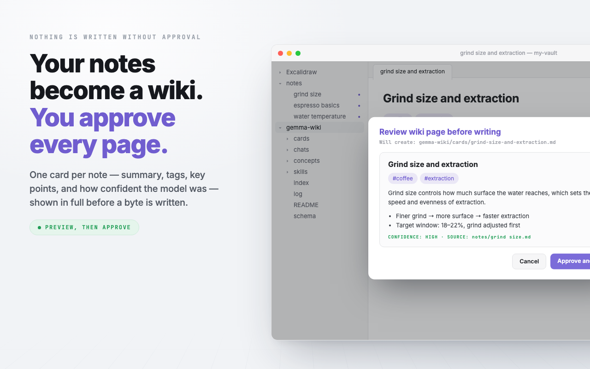
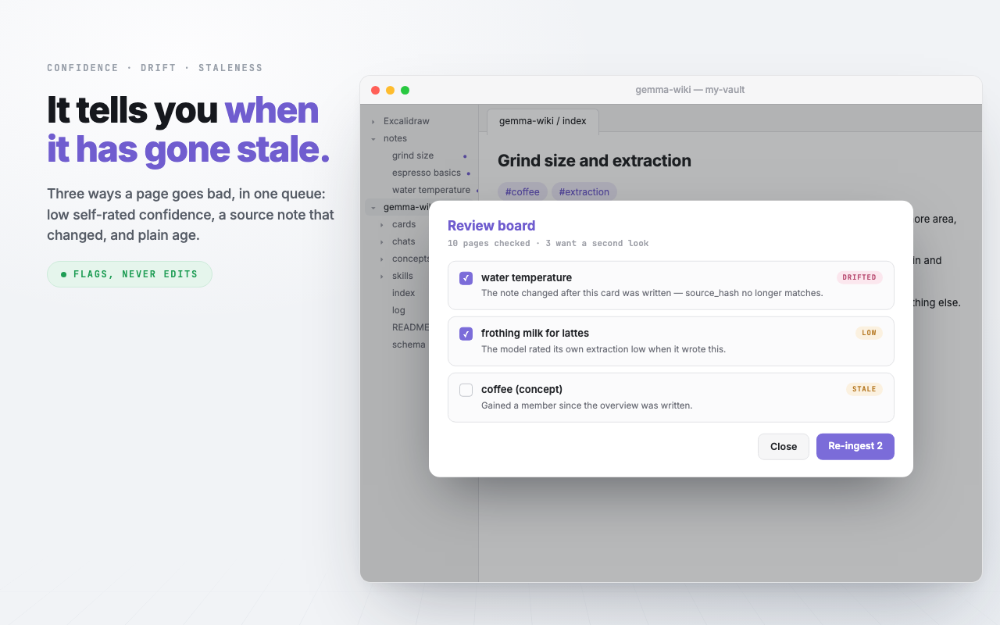

# Features in detail

The long form of [Features at a glance](../README.md#-features-at-a-glance): what each part does, and why it is built the way it is.

**The Karpathy loop** — raw notes stay read-only; the plugin maintains a separate `gemma-wiki/` layer:

- **Ingest** — one strict JSON extraction per note (summary, tags, key points, salient mentions, and a self-rated `high`/`med`/`low` confidence written to frontmatter), plus a validated multiple-choice pick of related pages from the index catalog. Everything previews in a review modal; nothing is written without approval. Ingested notes get a badge in the file explorer — pure UI decoration, the note file is untouched.
- **Scan (semi-automatic ingest)** — sweep the folders you named for new or changed notes, draft a card for each, and review them all in one list **sorted low-confidence first**, so the pages most in need of a human eye are the ones you read first. Untick anything that should not have become a page. Opt-in by scope: leave the folder list blank and scan refuses to run rather than sweeping your vault.
- **index.md / log.md** — a one-line-per-page catalog the query path reads first, and an append-only, grep-friendly activity log.
- **Query (Wiki mode)** — index-first retrieval with stopword filtering; the catalog and recent log always ride along, so meta-questions ("what did I add today?") work; answers are grounded only in retrieved material with honest refusals otherwise.
- **Whole-wiki questions ground in every page**, not in the ones that lexically match. *"What connects my pages"* is about the shape of the collection, so scoring it against page summaries matches nothing — the words in the question appear in no summary — and the model is handed zero pages and correctly reports it was given none. The two chips that ask this kind of question carry the flag; `loadPages` fills to the budget and stops.
- **Save an answer as a note** — every reply has a save action (same review gate), and it writes the answer **into your own notes**, beside the note it came from, named `gemma — Summarize — The perfect espresso shot` so the file explorer shows at a glance both that a model wrote it and what it was about, and recording in frontmatter which model and from which sources — the two things a copy-paste destroys silently. It lands in your folders, under your organisation, and it survives deleting the wiki folder, which nothing the plugin owns is meant to. Being an ordinary note of yours, it is also the one thing a saved answer never used to be: **ingestable**. Scan it and it becomes a card like any other note — which is the only route by which anything becomes material, because everything the wiki retrieves derives from a note you wrote.
- **Everything retrievable derives from a note you wrote.** That holds structurally rather than by convention: only `cards/` (one card per ingested note) and `concepts/` (built across those cards) are in the retrieval set.
- **Saved answers are never retrieved.** Karpathy's gist says explorations should compound and says nothing about trust, which is the poisoning loop — a wrong or stale answer re-entering context with the same weight as the notes. So a saved answer is not in the retrieval set at all: it is an ordinary note of yours, kept to re-read, with frontmatter recording which model wrote it and from which sources. The one route back in is deliberate and human — judge it, and ingest it like anything else you wrote.
- **Concept pages** — pick a tag or mention two or more pages share, and the plugin writes a page *above* them that links down into each one. Ingest ripples into them, and member lists self-heal in both directions.

**Keeping it honest** — a wiki nobody reviews is the failure mode this is built against:

- **Review board** — three ways a page goes bad, in one queue: low self-rated confidence, **source drift** (the raw note changed since ingest, caught by `source_hash`), and staleness. Concept overviews are checked too.
- **Provenance spot-check** — takes a page's key points back to the raw note to find the sentence each came from, and flags the ones that cannot be traced. It reads eight pages a run, and which eight is decided without the model: every card is matched against its note, and the pages whose mentions and key points are least borne out go first. A mention the note never uses is reported as a fact, here and on the review board.
- **Contradiction sweep** — checks pairs of pages that share a tag for claims that disagree, recently-changed pairs first. It flags with the model's reason quoted and **never edits** — you decide which one was wrong.
- **Tidy the wiki** — one command that checks first and then fixes only what you tick. The check is model-free: orphan pages, index entries pointing at deleted pages, pages missing from the index, how far your pages' tags have drifted from the vocabulary, and which subjects enough pages share for a concept page that nobody has built yet. The four repairs — make links mutual, drop dead index entries, rebuild the vocabulary, apply it to existing pages — are always offered, ticked where the check found something; each runs in turn behind its own preview. Availability is never tied to detection, because a check good enough to pick a sensible default is not good enough to be the only way in.
- **Background count** (off by default) — periodically *counts* new or changed notes into a status-bar chip. Counting never runs the model; drafting only happens when you click.

**Config as notes** — the rules live as plain markdown you can read, edit and version:

- **`schema.md`** — your tag vocabulary, naming rules, a **rejected list** (a tag you deleted by hand does not come back), and an **alias table**: approving a retag records that the old tag *means* the new one, which is what lets a page still carrying `llm-eval` be recognised as being about `evals`. Before the plugin rewrites this file it saves the previous version beside it (`schema.md.bak.<date>`, newest 5 kept) — the one generated file you could not otherwise get back. **Tidy the wiki** rebuilds the vocabulary from the tags your pages actually use — having local Gemma fold near-synonyms together — and applies it to existing pages. Two separate ticks, each behind its own preview. The rebuild is also a button in Settings. Approving a retag also writes an **aliases** list — `old-tag: vocabulary-tag` — so a page still carrying the old name is still recognised as being about the same subject; edit or delete those lines freely, and an alias pointing at a rejected tag is ignored.
- **`skills/`** — one file per entry in the ⚡ menu. Frontmatter for name/icon/mode, the body is the prompt; a `> [!info]` callout in the body is documentation and is stripped before the model sees it. `fill: true` puts the prompt in the input box and waits rather than sending, for a skill that has to be aimed at something. Ships with a README and two examples, which carry a `stamp:` hash so a later release can improve them **unless you have edited the file**, in which case it is yours forever.
- **`chats/`** — a conversation you pressed save on, one file per thread, with its own `index.md` listing them newest first. **Nothing in it is retrieved, indexed, linted or scanned** — an answer is output, never input, and a chat sitting in the wiki index would be indistinguishable from a page. It is also the only thing under the wiki folder the plugin cannot rebuild from your notes, so move it out before clearing that folder.
- **Every folder has a README** explaining what belongs in it, and the layout is shown in Settings with per-row state, generated from the same list the scaffold builds from.

**Chat panel** — shadcn-inspired monochrome, theme-variable driven:

- **Two grounding modes**: *This note* (the open file) and *Wiki* (your ingested pages).
- **Deterministic Sources row** on every answer — the plugin lists exactly what was used, clickable; citation is never left to the model.
- **`+` attachments** — fuzzy-pick any notes as removable context pills, in either mode.
- **⚡ Skills** — canned single-task prompts: *Quiz*, *Flashcards*, *Find gaps*, plus *Action items* and *Unclear bits* as editable files, plus anything else in `skills/`. A skill file is frontmatter and a prompt, so the menu holds *questions*; anything that **does** something (scan, file a note, reformat one) is a chip above the input instead.
- **Skills declare the mode they need, and are greyed when it is the wrong one** rather than switching you into it — a menu item should not quietly change what the panel is grounded in. All the shipped ones are note-scoped, because in Wiki mode they retrieved nothing: the lexical scorer matches prompt words against page summaries, and *"create practice questions from this material"* shares no vocabulary with a page about compound interest.
- **✨ Improve formatting** — the one write action on raw notes, and the most constrained call in the plugin: structure/formatting/typos only, wording and voice preserved, full-result preview before anything is written. Long notes are split on headings and blank lines into passes that each fit the context window, rewritten one pass at a time and stitched back together; a selection still narrows it to one section.
- **Fixed chips above the input**, the one part of the panel that never disappears. In Wiki mode: *Scan a folder* and *Find connections* — and the first becomes **Stop scan** while a scan is running, including one started from the command palette. They do not rearrange themselves when the wiki is empty: asking a wiki question with nothing filed answers "there is nothing here" and **that answer carries the buttons to fix it**, so the remedy travels with the problem instead of hiding the other chips from the person still working out what this does.
- Streaming replies with a typing spinner, stop button, copy/regenerate actions, auto-growing + expandable input, clear-chat, hover tooltips everywhere.

**Engineering rules the whole plugin follows**:

- Every model operation is **one structured ask** — no tool loops, no multi-step planning; small local models are unreliable at chaining and reliable at filling one schema.
- **One operation at a time.** There is one engine, one status line and one clock, so starting a second is refused with a message naming what is already running — and every door it could come through closes while one runs: the chips grey, the skills menu greys with a line saying what is busy, and the chat input refuses. A streaming answer counts as an operation, which it did not at first, so pressing *Formatting* mid-answer used to start a second call on the same GPU.
- Every write goes through a **preview-approve gate**. Raw notes are modified by exactly two features (Improve, and Suggest tags & links), both always previewed.
- Grounding means **the material is the subject**, not the only vocabulary the model may use. Both modes hold the same line: a question about *your material* is answered only from it, and refused honestly when it does not answer; a question about *what something means* is explained, keeping what your material states separate from what the term means. What differs between the modes is scope, not the rule — and in Wiki mode the separation has to be visible in the text, because the Sources row stands for pages you are not looking at.
- The prompt separates four cases, because collapsing them is how a small model produces confidently wrong refusals: a **question of fact** the material does not answer (say so), an **instruction** to work with it (carry it out — asked for flashcards it used to go looking for flashcards *inside* the note and refuse), a **request to explain** something the note uses (explain it; echoing the note's own sentence back is not an answer), and a **request it cannot parse** (say it did not follow, and ask again). The last matters most: a fragment used to come back as *"I do not have information regarding X in the provided notes"*, which implies the notes might have had it when the truth is the model did not understand the question.
- Per-feature input budgets are derived from the context window **the engine actually granted**, read back from `Engine.create` rather than assumed from the setting — LiteRT-LM may clamp `maxNumTokens`, and every budget derived from the request would then overshoot.
- **One notification vocabulary** (`src/notify.ts`): six kinds each with a single meaning, three durations instead of ten hand-picked numbers, and no call site choosing a millisecond count. `noop` deliberately carries no mark — a command that correctly did nothing is not an event. Failures never print a raw exception; they name the operation, give the first line of the reason, and say where the rest is. Warnings and errors are also appended to `log.md`, because a toast is not a record.
- **Three surfaces, one job each.** A toast is a *moment*, so it reports starts and results. A run is not a moment: progress lives in the status bar, which is always visible, never covers the note, cannot be dismissed by accident, and can be clicked to repeat itself. And a result dialog **only opens by itself if you never looked away** — if you went back to your notes while a multi-minute scan ran, it waits on the status bar until you ask for it, rather than stealing the window out from under whatever you were typing.
